# 订单、库存、积分全流程设计文档

## 文档信息

- **项目**: 电商系统全流程设计
- **日期**: 2026-03-14
- **版本**: v1.0

---

## 一、订单全流程

### 1.1 订单状态机

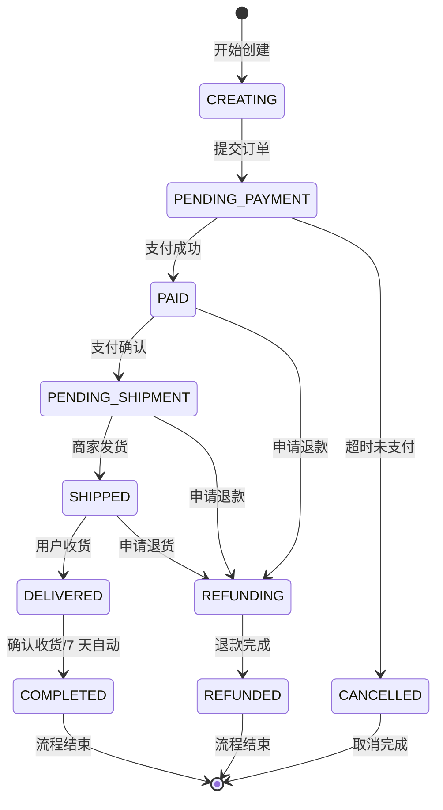

**状态说明**:
- `CREATING`: 订单创建中（购物车）
- `PENDING_PAYMENT`: 待支付（库存已锁定）
- `PAID`: 已支付（待发货）
- `PENDING_SHIPMENT`: 待发货
- `SHIPPED`: 已发货
- `DELIVERED`: 已收货
- `COMPLETED`: 已完成
- `CANCELLED`: 已取消
- `REFUNDING`: 退款中
- `REFUNDED`: 已退款

### 1.2 订单创建时序图

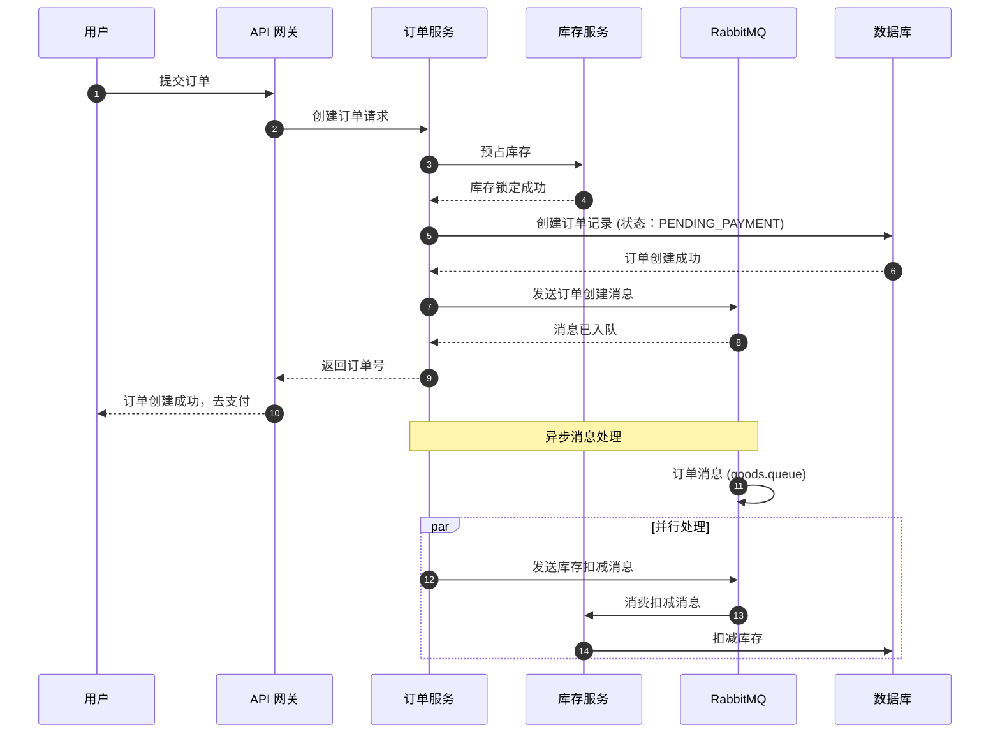

### 1.3 订单支付时序图

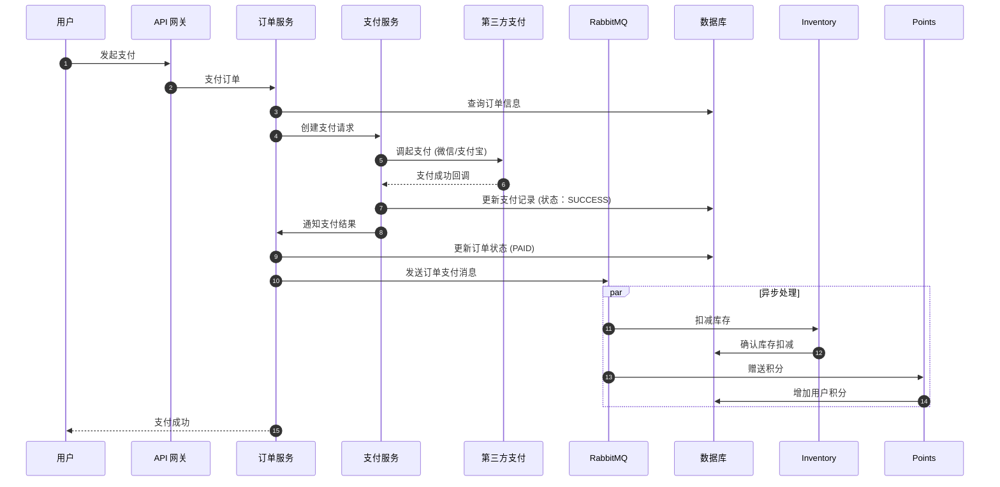

### 1.4 订单数据流程图

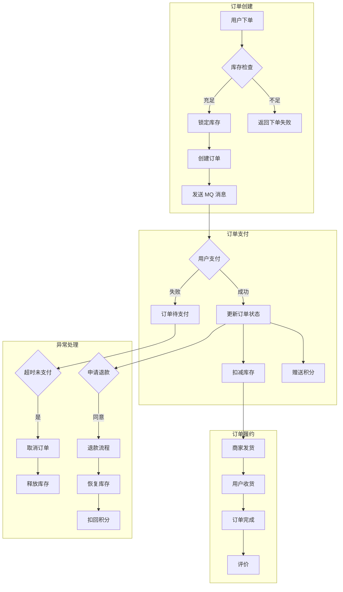

### 1.5 订单核心表结构

```sql
-- 订单主表
CREATE TABLE orders (
    id VARCHAR(32) PRIMARY KEY,
    order_no VARCHAR(64) UNIQUE NOT NULL COMMENT '订单编号',
    user_id BIGINT NOT NULL COMMENT '用户 ID',
    
    -- 金额信息
    total_amount DECIMAL(10,2) NOT NULL COMMENT '订单总金额',
    pay_amount DECIMAL(10,2) NOT NULL COMMENT '实付金额',
    freight_amount DECIMAL(10,2) DEFAULT 0 COMMENT '运费',
    coupon_amount DECIMAL(10,2) DEFAULT 0 COMMENT '优惠券金额',
    points_amount DECIMAL(10,2) DEFAULT 0 COMMENT '积分抵扣金额',
    
    -- 状态
    status TINYINT NOT NULL DEFAULT 0 COMMENT '订单状态',
    
    -- 支付信息
    payment_type TINYINT COMMENT '支付方式',
    payment_time TIMESTAMP COMMENT '支付时间',
    
    -- 物流信息
    shipping_code VARCHAR(50) COMMENT '物流单号',
    shipping_company VARCHAR(50) COMMENT '物流公司',
    shipping_time TIMESTAMP COMMENT '发货时间',
    receive_time TIMESTAMP COMMENT '收货时间',
    
    -- 时间戳
    created_at TIMESTAMP DEFAULT CURRENT_TIMESTAMP,
    updated_at TIMESTAMP DEFAULT CURRENT_TIMESTAMP ON UPDATE CURRENT_TIMESTAMP,
    deleted_at TIMESTAMP NULL,
    
    INDEX idx_user_id (user_id),
    INDEX idx_status (status),
    INDEX idx_created_at (created_at),
    INDEX idx_order_no (order_no)
);

-- 订单明细表
CREATE TABLE order_items (
    id BIGINT PRIMARY KEY AUTO_INCREMENT,
    order_id VARCHAR(32) NOT NULL,
    product_id BIGINT NOT NULL,
    product_name VARCHAR(255) NOT NULL,
    product_sku VARCHAR(100) NOT NULL,
    quantity INT NOT NULL,
    unit_price DECIMAL(10,2) NOT NULL,
    total_price DECIMAL(10,2) NOT NULL,
    created_at TIMESTAMP DEFAULT CURRENT_TIMESTAMP,
    
    INDEX idx_order_id (order_id),
    INDEX idx_product_id (product_id)
);

-- 支付记录表
CREATE TABLE payments (
    id VARCHAR(32) PRIMARY KEY,
    order_id VARCHAR(32) NOT NULL,
    amount DECIMAL(10,2) NOT NULL,
    payment_type TINYINT NOT NULL,
    third_party_id VARCHAR(100) COMMENT '第三方支付流水号',
    status TINYINT NOT NULL DEFAULT 0,
    payment_time TIMESTAMP NULL,
    created_at TIMESTAMP DEFAULT CURRENT_TIMESTAMP,
    
    INDEX idx_order_id (order_id),
    INDEX idx_third_party_id (third_party_id)
);

-- 物流记录表
CREATE TABLE shipments (
    id BIGINT PRIMARY KEY AUTO_INCREMENT,
    order_id VARCHAR(32) NOT NULL,
    shipping_company VARCHAR(50) NOT NULL,
    tracking_no VARCHAR(100) NOT NULL,
    shipping_time TIMESTAMP NULL,
    receive_time TIMESTAMP NULL,
    status TINYINT NOT NULL DEFAULT 0,
    created_at TIMESTAMP DEFAULT CURRENT_TIMESTAMP,
    
    INDEX idx_order_id (order_id),
    INDEX idx_tracking_no (tracking_no)
);
```

---

## 二、库存全流程

### 2.1 库存状态机

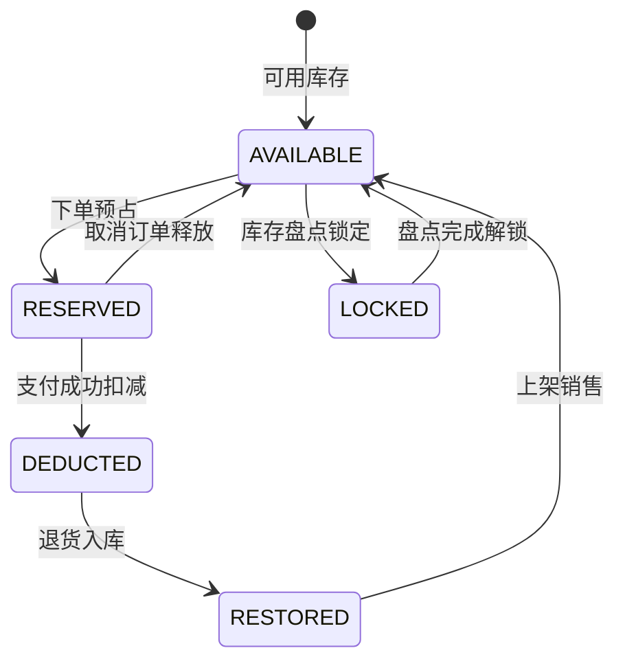

**状态说明**:
- `AVAILABLE`: 可用库存（可销售）
- `RESERVED`: 已预占（订单待支付）
- `DEDUCTED`: 已扣减（订单已支付）
- `LOCKED`: 锁定中（盘点/调拨）
- `RESTORED`: 已恢复（退货）

### 2.2 库存扣减时序图

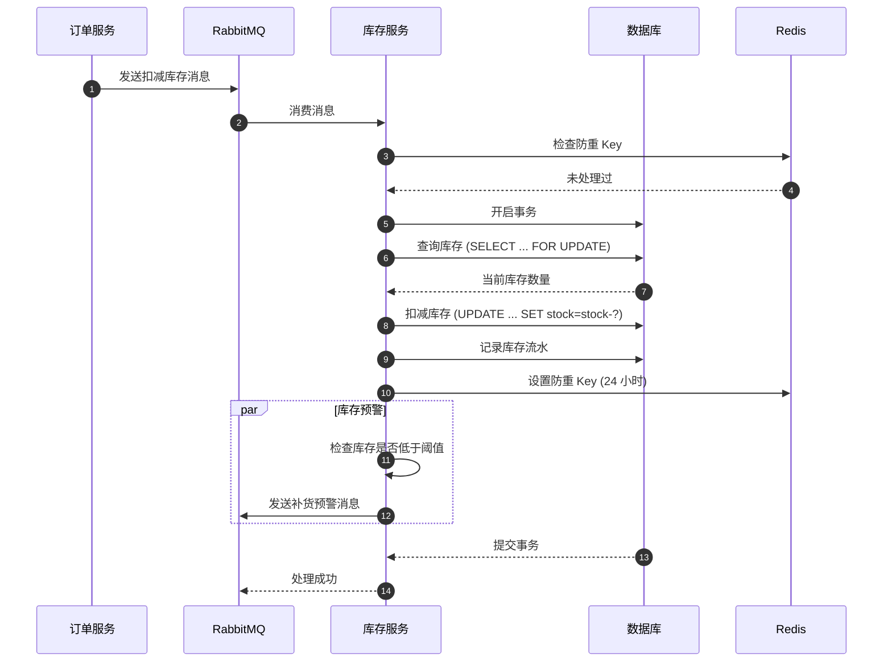

### 2.3 库存恢复时序图（订单取消）

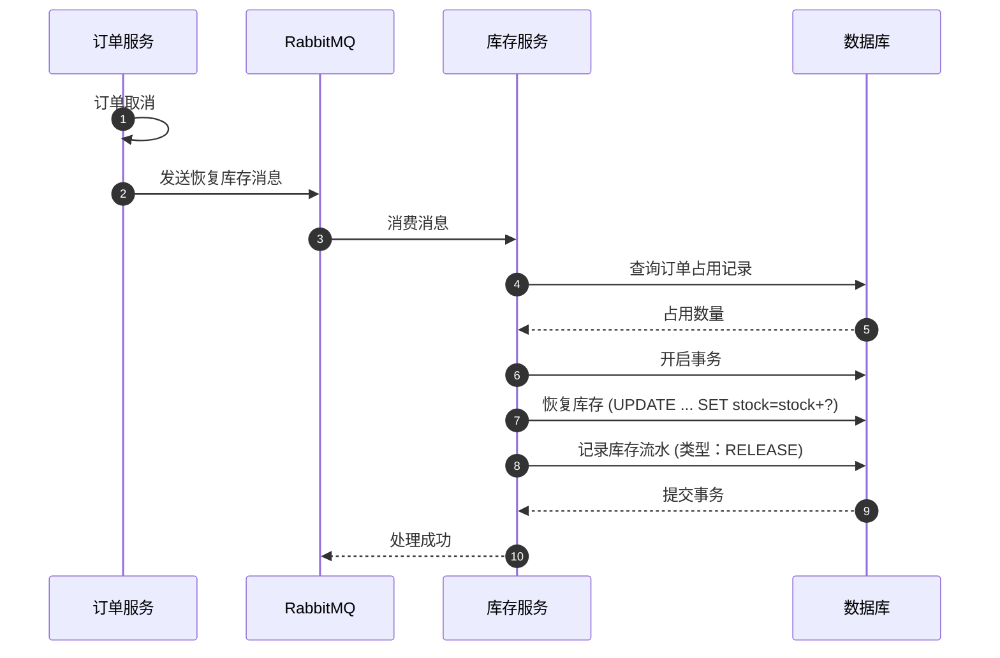

### 2.4 库存数据流程图

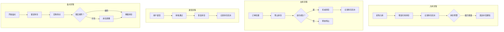

### 2.5 库存核心表结构

```sql
-- 库存表
CREATE TABLE inventory (
    id BIGINT PRIMARY KEY AUTO_INCREMENT,
    product_id BIGINT NOT NULL,
    warehouse_id BIGINT NOT NULL,
    
    -- 库存数量
    stock INT NOT NULL DEFAULT 0 COMMENT '可用库存',
    locked_stock INT NOT NULL DEFAULT 0 COMMENT '锁定库存',
    reserved_stock INT NOT NULL DEFAULT 0 COMMENT '预占库存',
    
    -- 库存水位
    warn_stock INT NOT NULL DEFAULT 10 COMMENT '预警库存',
    max_stock INT NOT NULL DEFAULT 1000 COMMENT '最大库存',
    
    version INT NOT NULL DEFAULT 1 COMMENT '乐观锁版本',
    created_at TIMESTAMP DEFAULT CURRENT_TIMESTAMP,
    updated_at TIMESTAMP DEFAULT CURRENT_TIMESTAMP ON UPDATE CURRENT_TIMESTAMP,
    
    UNIQUE KEY uk_product_warehouse (product_id, warehouse_id),
    INDEX idx_stock_warn (stock, warn_stock)
);

-- 库存流水表
CREATE TABLE inventory_log (
    id BIGINT PRIMARY KEY AUTO_INCREMENT,
    product_id BIGINT NOT NULL,
    warehouse_id BIGINT NOT NULL,
    
    -- 变动信息
    change_type TINYINT NOT NULL COMMENT '变动类型',
    change_qty INT NOT NULL COMMENT '变动数量',
    before_qty INT NOT NULL COMMENT '变动前数量',
    after_qty INT NOT NULL COMMENT '变动后数量',
    
    -- 关联信息
    order_id VARCHAR(32) COMMENT '订单 ID',
    biz_type VARCHAR(50) COMMENT '业务类型',
    biz_id VARCHAR(100) COMMENT '业务 ID',
    
    remark VARCHAR(255) COMMENT '备注',
    created_at TIMESTAMP DEFAULT CURRENT_TIMESTAMP,
    
    INDEX idx_product_id (product_id),
    INDEX idx_order_id (order_id),
    INDEX idx_created_at (created_at)
);

-- 库存占用表
CREATE TABLE inventory_reserved (
    id BIGINT PRIMARY KEY AUTO_INCREMENT,
    product_id BIGINT NOT NULL,
    warehouse_id BIGINT NOT NULL,
    order_id VARCHAR(32) NOT NULL,
    reserved_qty INT NOT NULL,
    status TINYINT NOT NULL DEFAULT 0 COMMENT '状态',
    expire_time TIMESTAMP NOT NULL COMMENT '过期时间',
    created_at TIMESTAMP DEFAULT CURRENT_TIMESTAMP,
    
    UNIQUE KEY uk_order_product (order_id, product_id),
    INDEX idx_expire_time (expire_time)
);
```

---

## 三、积分全流程

### 3.1 积分状态机

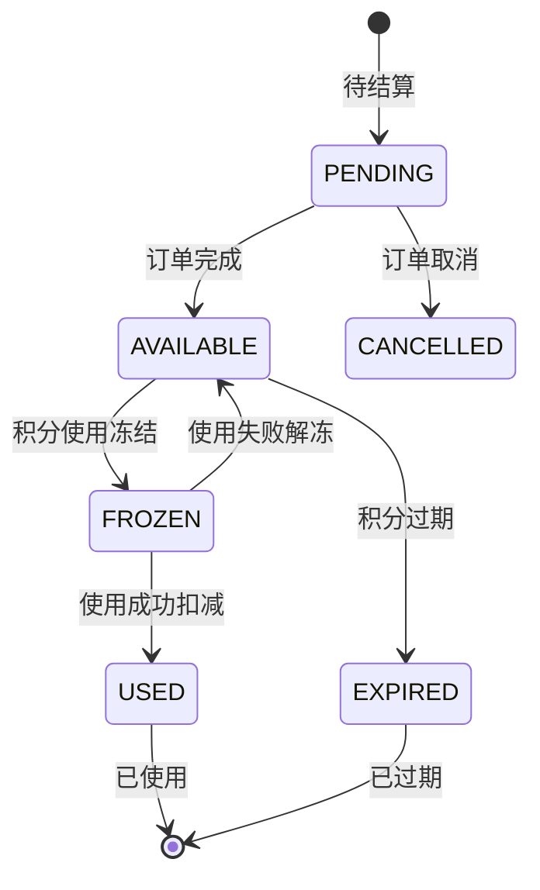

**状态说明**:
- `PENDING`: 待结算（订单待完成）
- `AVAILABLE`: 可用积分
- `FROZEN`: 已冻结（积分支付中）
- `USED`: 已使用
- `CANCELLED`: 已取消
- `EXPIRED`: 已过期

### 3.2 积分获取时序图

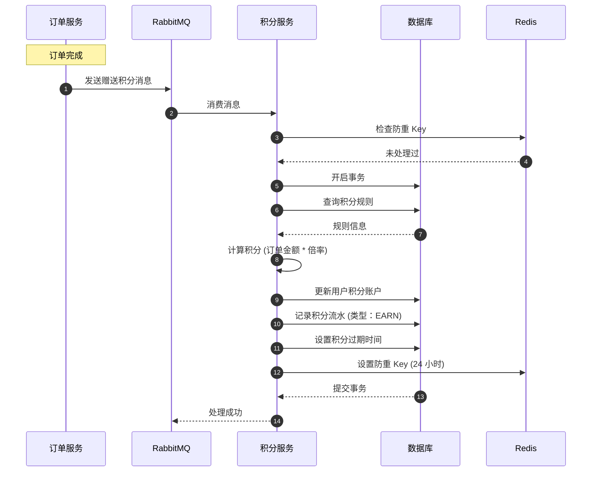

### 3.3 积分扣减时序图（积分抵扣）

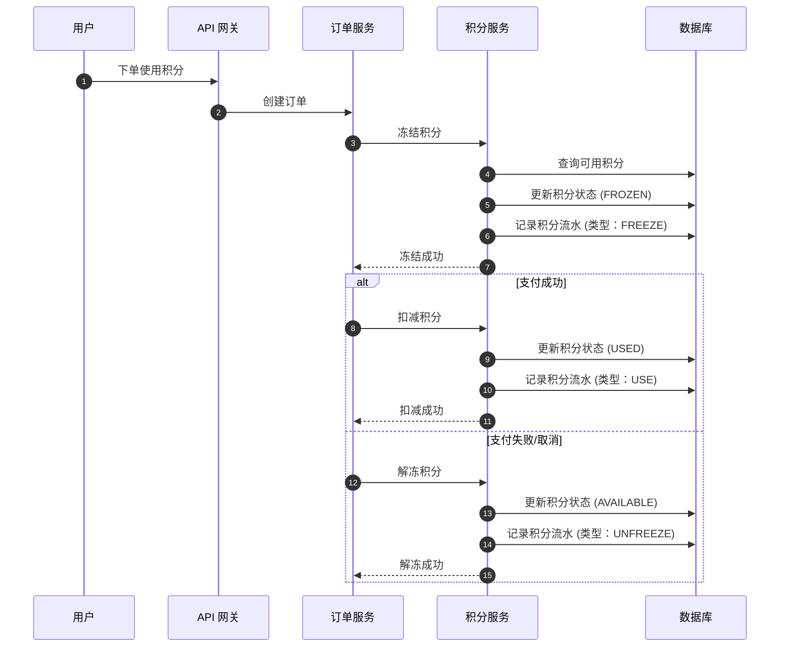

### 3.4 积分数据流程图

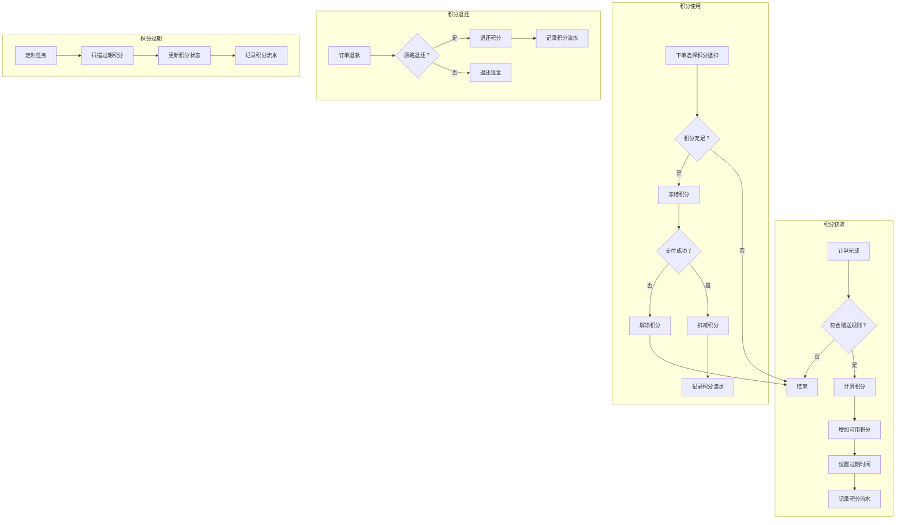

### 3.5 积分核心表结构

```sql
-- 用户积分账户表
CREATE TABLE user_points (
    id BIGINT PRIMARY KEY AUTO_INCREMENT,
    user_id BIGINT NOT NULL UNIQUE,
    
    -- 积分余额
    available_points INT NOT NULL DEFAULT 0 COMMENT '可用积分',
    frozen_points INT NOT NULL DEFAULT 0 COMMENT '冻结积分',
    used_points INT NOT NULL DEFAULT 0 COMMENT '已使用积分',
    
    -- 累计统计
    total_earned INT NOT NULL DEFAULT 0 COMMENT '累计获得',
    total_used INT NOT NULL DEFAULT 0 COMMENT '累计使用',
    
    version INT NOT NULL DEFAULT 1,
    created_at TIMESTAMP DEFAULT CURRENT_TIMESTAMP,
    updated_at TIMESTAMP DEFAULT CURRENT_TIMESTAMP ON UPDATE CURRENT_TIMESTAMP,
    
    INDEX idx_user_id (user_id)
);

-- 积分流水表
CREATE TABLE point_transaction (
    id BIGINT PRIMARY KEY AUTO_INCREMENT,
    user_id BIGINT NOT NULL,
    
    -- 变动信息
    change_type TINYINT NOT NULL COMMENT '变动类型',
    change_points INT NOT NULL COMMENT '变动积分',
    balance_before INT NOT NULL COMMENT '变动前余额',
    balance_after INT NOT NULL COMMENT '变动后余额',
    
    -- 关联信息
    order_id VARCHAR(32) COMMENT '订单 ID',
    biz_type VARCHAR(50) COMMENT '业务类型',
    biz_id VARCHAR(100) COMMENT '业务 ID',
    
    -- 过期时间
    expire_time TIMESTAMP NULL COMMENT '过期时间',
    remark VARCHAR(255) COMMENT '备注',
    created_at TIMESTAMP DEFAULT CURRENT_TIMESTAMP,
    
    INDEX idx_user_id (user_id),
    INDEX idx_order_id (order_id),
    INDEX idx_expire_time (expire_time),
    INDEX idx_created_at (created_at)
);

-- 积分规则表
CREATE TABLE point_rules (
    id BIGINT PRIMARY KEY AUTO_INCREMENT,
    rule_name VARCHAR(100) NOT NULL,
    rule_type TINYINT NOT NULL COMMENT '规则类型',
    
    -- 计算规则
    base_points INT NOT NULL DEFAULT 1 COMMENT '基础积分',
    multiplier DECIMAL(5,2) NOT NULL DEFAULT 1.00 COMMENT '倍率',
    max_points INT COMMENT '单次上限',
    
    -- 适用范围
    category_ids VARCHAR(500) COMMENT '适用类目',
    product_ids VARCHAR(500) COMMENT '适用商品',
    
    -- 有效期
    valid_from DATE COMMENT '生效日期',
    valid_to DATE COMMENT '失效日期',
    
    status TINYINT NOT NULL DEFAULT 1 COMMENT '状态',
    created_at TIMESTAMP DEFAULT CURRENT_TIMESTAMP,
    updated_at TIMESTAMP DEFAULT CURRENT_TIMESTAMP ON UPDATE CURRENT_TIMESTAMP
);
```

---

## 四、三系统集成流程

### 4.1 订单 - 库存 - 积分集时序图

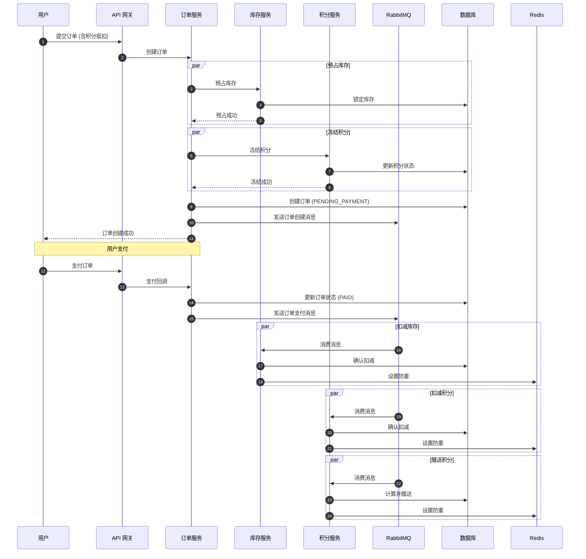

### 4.2 完整数据流程图

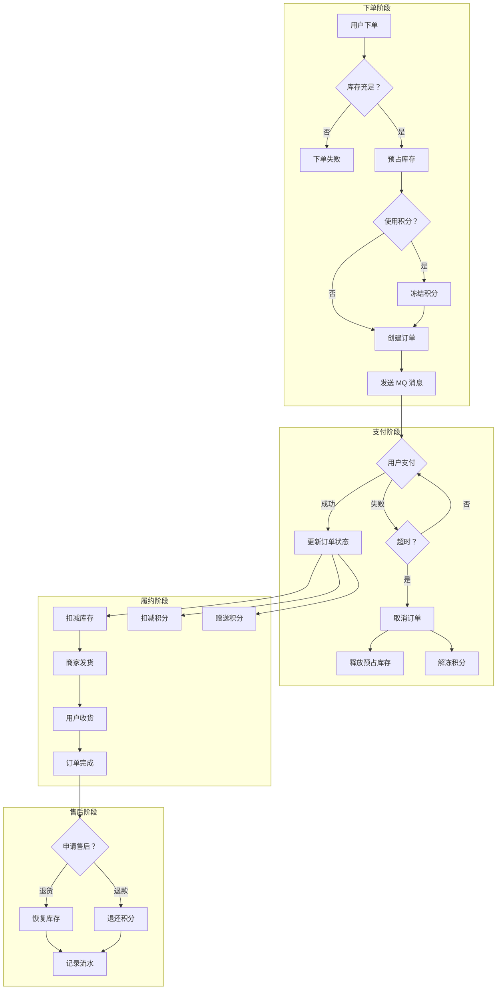

### 4.3 关键集成点

| 集成点 | 触发时机 | 数据流向 | 幂等处理 |
|--------|----------|----------|----------|
| **预占库存** | 创建订单 | Order→Inventory | Redis 防重 |
| **冻结积分** | 使用积分下单 | Order→Points | Redis 防重 |
| **扣减库存** | 支付成功 | Order→MQ→Inventory | Redis+ 流水号 |
| **扣减积分** | 支付成功 | Order→MQ→Points | Redis+ 流水号 |
| **赠送积分** | 订单完成 | Order→MQ→Points | Redis+ 流水号 |
| **恢复库存** | 订单取消 | Order→MQ→Inventory | Redis+ 流水号 |
| **解冻积分** | 订单取消 | Order→MQ→Points | Redis+ 流水号 |

---

## 五、技术实现要点

### 5.1 幂等性保证

```go
// Redis 防重 Key 设计
key := fmt.Sprintf("mq:processed:%s", md5(messageBody))
if redis.SetNX(key, "1", 24*time.Hour) == false {
    return nil // 已处理过
}
// 处理业务逻辑
```

### 5.2 分布式事务

使用**最终一致性**方案：
1. 本地事务 + MQ 消息
2. 消息确认机制
3. 失败重试 + 告警

### 5.3 性能优化

- **库存扣减**: Redis Lua 脚本原子操作
- **积分查询**: Redis 缓存用户积分余额
- **订单查询**: 分库分表 + ES 搜索

---

**文档版本**: v1.0  
**最后更新**: 2026-03-14
